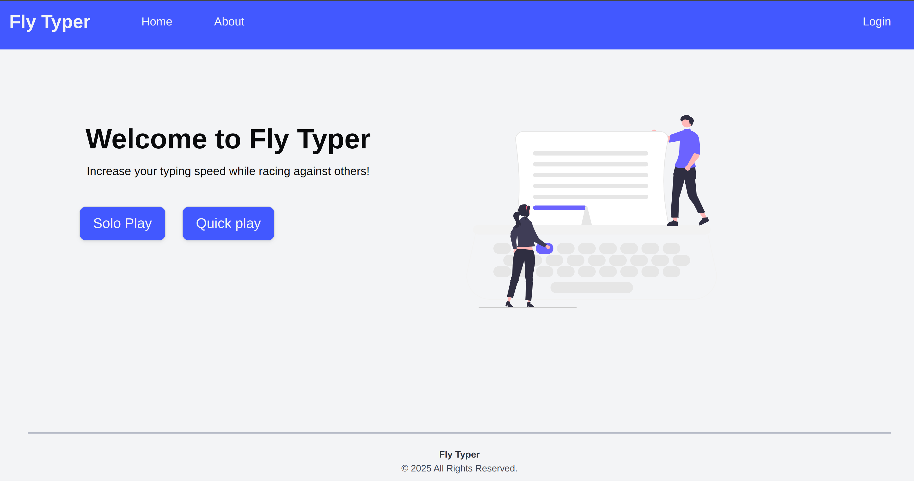
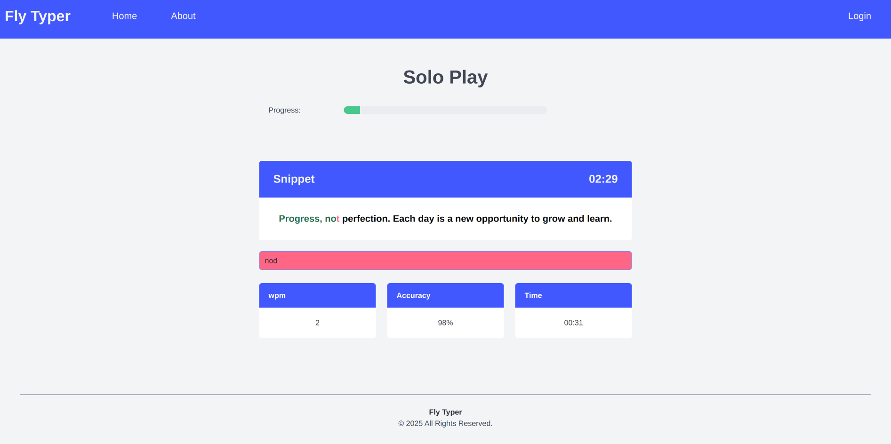

# Fly Typer (Legacy Project)

 "Fly Typer is an interactive multiplayer game where you compete against real players in real-time, racing to see who can type the fastest and most accurately."
   

## Getting started

- npm install in the client folder
- npm install in the server folder
- npm run dev to run client
- nodemon index.js to run server

## Tech Stack

- React with vite for front-end
- Styled with bulma.io
- Backend-Express.js
- Socket.io for multiplayer functionality

By Eric & Guillermo